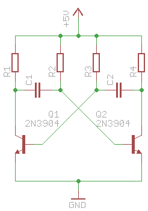

# ライブラリと回路情報からレンダリングされる内容を作り出す
## やってTRY（１）：ファイルを直接見てシンボルを描画

ここまで調べてみてある程度方針が固まってきました。`.../sheet/instances/instance/`以下から
`part`、`gate`、`x`、`y`を得ます。この中の`part`を使って
`.../schematic/parts/part`の該当部品を引いて`library`、`deviceset`、`device`を得ます。
得られた`library`と`deviceset`を使って`.../schematic/libraries/library/devicesets/`の中から
`deviceset`を得ます。`deviceset/gates/gate`内の`symbol`属性を使って`/schematic/libraries/library/symbols/symbol`
を得ます。これである部品のシンボルが得られるので、シンボル内の部品[^components]それぞれについて座標(`x`,`y`)を中心に描画すれば
どうやらライブラリ内のシンボルを描画することはできそうに思えます。

[^components]: _wire_/_circle_/_text_/_pin_ などです。回路図ファイルは優先順位計算がないっぽいのでポリゴンも描けると思います。

[instance to symbol query tree](data/instance-to-symbol.diag){.blockdiag}

試しにシンプルな回路を描いてみて、実際にシンボル情報までたどり着いてみます。Eagle付属のライブラリを使って
トランジスタ2石の無安定（非安定）バイブレータ[^wikipedia]を描いてみます。



[^wikipedia]: <https://ja.wikipedia.org/wiki/マルチバイブレータ#非安定マルチバイブレータ回路>

### とりあえず１個描く
#### シンボルまでたどり着く {-}

早速回路図ファイルを開き、`instances`を確認すると以下のようになっています。
_Eagle付属ライブラリはけっこう情報が詰め込まれている[^packages]ので、この回路規模でも簡単に6000行のファイルになっています。_

[packages](data/astable_multivibrator.sch){.listingtable type=xml from=5914 to=5925}

[^packages]: ひとつの回路図シンボルに対し20〜30くらいのパッケージ情報が書かれているのが3種類、
1パッケージ5行でこの規模になってしまいます。

ここにある"Q1"をレンダリングしてみます。まず`part="Q1"`から`part`を引きます。

[part](data/astable_multivibrator.sch){.listingtable type=xml from=5899 to=5899}

ここから"transistor-npn"ライブラリの"2N3904"という`deviceset`にたどり着きます。

[deviceset](data/astable_multivibrator.sch){.listingtable type=xml from=111 to=128}

この`deviceset`には`gate`が１種類だけなのでそのまま`NPN`という`symbol`を"transistor-npn"ライブラリ内で探します。

[symbol](data/astable_multivibrator.sch){.listingtable type=xml from=91 to=108}

あとはこれらを組み合わせればQ1が描画できます。

#### 座標系に注意 {-}

筆者はとりあえずSVGに出力することを考えましたが、そういえば座標系変換が必要なことに気づきました。
Eagleの座標系は数学で習ったいわゆる直交(XY)座標系で、SVGは標準的な画像・映像の座標系です。
したがってSVGにするときはY座標の+/-を反転します。
予めY軸を反転する設定をしたSVGのg要素を用意して、そのなかに他の図形を入れる構造にすれば座標系のことは悩まなくて良さそうです。

#### 線分 {-}

Q1の線分(`wire`要素)を描きます。

[wire](data/astable_multivibrator.sch){.listingtable type=xml from=92 to=101}

Q1の座標は$(45.72,50.8)$でした。そこからの相対座標で$(2.54,2.54)$ -> $(0.508,1.524)$の線分を太さ0.1524mm、
レイヤ94の配色で引きます。pythonのsvgwriteライブラリを使うとこんな感じになります。

```python
import svgwrite

...
dwg = svgwrite.Drawing(filename="Q1.svg", debug=True)
...
tr = dwg.g()
dwg.add(tr)
tr.add(dwg.line(start=(2.54*mm, 2.54*mm), end=(0.508*mm, 1.524*mm), stroke="black", stroke_width=0.1524*mm,
stroke_linecap="round"))
...
tr.save()
```

#### 矩形 {-}

次は矩形です。SVGの矩形の指定方法(始点（左下）の座標と大きさ)に合わせる変換が必要です。

[rectangle](data/astable_multivibrator.sch){.listingtable type=xml from=104 to=104}
<!-- <rectangle x1="-0.254" y1="-2.54" x2="0.508" y2="2.54" layer="94"/> -->

#### ピンまたは接続点 {-}

続いて`pin`要素オブジェクトです。始点座標から水平または垂直の線分を描きます。`visible`属性が"off"なので
ピン名・ピン番号とも書きません。

[pin](data/astable_multivibrator.sch){.listingtable type=xml from=165 to=167}

#### テキスト

最後にテキストオブジェクトです。

[text](data/astable_multivibrator.sch){.listingtable type=xml from=102 to=103}

### なんか部品化できそうな気がする
